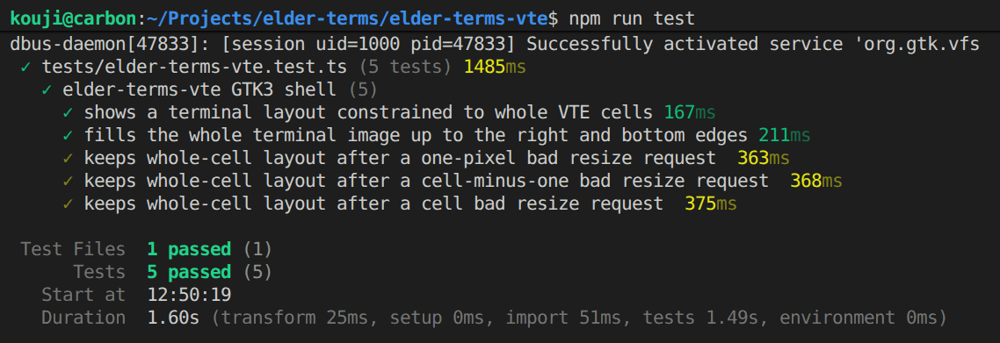

# gestament

TypeScriptベースの、GTKテストドライバライブラリ


[](https://www.repostatus.org/#wip)
[](https://opensource.org/licenses/MIT)
[](https://www.npmjs.com/package/gestament)

---

[(English is here)](./README.md)

## これは何?

GTK3,4アプリケーションのテストを簡単に記述したいと思ったことはありませんか？
ブラウザベースのアプリケーションであれば、UI/UXのテスト手法は様々な手段がありますが、GTKとなるとそうは行きません。

pythonを使用するテストドライバはありますが、私はTypeScriptに慣れているので、TypeScriptで書きたい。
更に言えば、TypeScriptでもブラウザベースでは様々なテストドライバがありますが、これらのテストインフラを流用することで相乗効果が見込めます。

つまり、以下のようなGTK3コードがあったとして:

```cpp
#include <gestament/gtk.h>

GtkWidget *window = gtk_window_new(GTK_WINDOW_TOPLEVEL);

// GtkLabelを生成
GtkWidget *label = gtk_label_new("Hello, gestament");
gestament_gtk_assign_accessible_id(label, "greeting_label");

gtk_container_add(GTK_CONTAINER(window), label);
```

このUIのテストを、以下のようにTypeScriptで書けるということです:

```typescript
import { describe, expect, it } from 'vitest';
import { launchGtkApp } from 'gestament';

// Vitestテスト実装
describe('sample GTK app', () => {
  it('shows greeting text', async () => {
    // GTKアプリケーションを起動
    const app = await launchGtkApp('./sample-app', []);

    try {
      // GtkLabelを取得
      const label = await app.getById('greeting_label');
      if (label.kind !== 'label') {
        throw new Error(`Unexpected widget kind: ${label.kind}`);
      }

      // 正しいラベル文字列が指定されていることを確認
      expect(await label.text()).toBe('Hello, gestament');
    } finally {
      await app.release();
    }
  });
});
```

例えば、これを `npm test` などとして、Vitestでテストできます:



### 機能

- GTKアプリケーションを子プロセスとして起動し、テストから操作できます。
- GTKアプリケーションのウインドウの特定、ウインドウ内のウィジェットの特定を行うAPIがあります。
- これらのAPIを使用して、ウィジェットの状態を確認したり操作したり出来ます。
- GTKアプリケーションのレンダリング結果をキャプチャして、表示範囲やクリップ状態を検証できます。
- キャプチャ画像を期待画像と比較し、ピクセル差分や構造類似度で検証できます。
- StatusNotifierItemベースのトレイアイコンを検出し、クリック、メタデータ取得、キャプチャを行えます。
- GTKアプリケーションを `xvfb` 上で動作させることにより、ヘッドレス環境で安定したテストを実現します。

### 環境

- Node.js version 20以上
- GTK3またはGTK4（ただし、GTK4はバージョン4.22以降が必要）
- Linux glibc i686,amd64,arm64,armv7l,riscv64

---

## インストール

0からテストプロジェクトを構築する例を示します。

まず、NPMパッケージをインストールする前に、GTK以外のネイティブパッケージをインストールしておきます。
GTKアプリケーション開発環境としてGTK本体、GLib、GDK Pixbufなどはインストール済みであることを前提にしています。

以下に、Debian/Ubuntu環境での例を示します:

```bash
sudo apt-get update
sudo apt-get install -y \
  at-spi2-core dbus dbus-x11 \
  libx11-6 libxtst6 \
  xauth xvfb
```

- `at-spi2-core` は、gestamentがウィジェットを特定・操作するために使用するAT-SPIの実行環境です。
- `libx11-6` と `libxtst6` は、X11画面キャプチャと入力操作で使用します。
- `dbus` / `dbus-x11` と `xvfb` / `xauth` は、内部Xvfbまたは `gestament-xvfb` でヘッドレス実行する場合に使用します。

以上でネイティブ環境の準備が出来ました。

NPMプロジェクトでは、様々なテストフレームワークの選択肢があります。
gestamentは特定のテストフレームワークに依存しませんが、以下では ViteとVitestを使用する例を示します:

```bash
# スキャフォールダーでViteプロジェクトを生成
npm create vite@latest gestament-tests -- --template vanilla-ts

cd gestament-tests

# Vitestテストドライバとgestamentをインストール
npm install
npm install -D vitest @types/node gestament
```

## 構成方法

GTKはC/C++プロジェクトで、最近ではmesonを使用したビルドが一般的です。
一方、gestamentはNPMプロジェクトであるため、gestamentからGTKのビルドとテスト実行を行えるように、ビルド環境を構成する必要があります。
以下にこの手順を示します。

### gestamentヘッダの参照

gestamentは、GTKアプリケーション側で使用するヘッダオンリーヘルパーを `include/gestament/gtk.h` として同梱しています。
このヘルパーの利用はオプションですが、使用する場合は、NPMパッケージ内の `include` ディレクトリをインクルードパスに追加します。

GTKプロジェクトとNPMプロジェクトの位置関係が固定されている場合は、mesonで直接指定できます:

```meson
gestament_include = include_directories('../node_modules/gestament/include')

executable(
  'my-app',
  sources,
  include_directories: gestament_include,
  dependencies: gtk_dep,
)
```

位置関係をビルド側に固定したくない場合は、 `gestament-config` でincludeパスを取得できます:

```meson
gestament_config = find_program('npx')
gestament_include_dir = run_command(
  gestament_config,
  ['gestament-config', '--includedir'],
  check: true,
).stdout().strip()

executable(
  'my-app',
  sources,
  cpp_args: ['-I' + gestament_include_dir],
  dependencies: gtk_dep,
)
```

Makefileの場合は、以下のように `--cflags` を使用できます:

```make
GESTAMENT_CFLAGS := $(shell npx gestament-config --cflags)
CXXFLAGS += $(GESTAMENT_CFLAGS)
```

### GTKアプリケーションの構成

GTKアプリケーションは、そのままではgestamentでテストを行えません。

gestamentは、GTKアプリケーションのウインドウやウィジェットを "AT-SPI" で特定・操作します。
AT-SPIは、これらの要素を "accessible ID" で特定するため、ウインドウやウィジェットにaccessible IDを指定しておく必要があるのです。

例えば、ある `GtkLabel` が `This is foobar` と表示されているかどうかを確認する場合、
そのラベルがどこに配置されているかを特定するために、そのラベルに `foobar_label` のようなaccessible IDを指定しておく必要があります。

これは、HTML DOMで言うところの `id` 属性とほぼ同じであり、 `parent.getElementById()` でエレメントを特定することに似ています。

プログラマブルにウインドウやウィジェットを生成する場合は、以下のようにaccessible IDを指定します:

```cpp
#include <atk/atk.h>

// GtkLabelを生成する
GtkWidget *label = gtk_label_new("Hello, gestament");

// AT-SPIを使用してaccessible IDを設定する (GTK3)
AtkObject *accessible = gtk_widget_get_accessible(widget);
if (accessible != NULL) {
  atk_object_set_accessible_id(accessible, "foobar_label");
}
```

但し、このコードはGTK3で、GTK4ではaccessible IDの指定を異なる方法で指定する必要があります。
これらの差異を吸収するため、 gestamentでは以下のようなヘルパー関数 `gestament_gtk_assign_accessible_id()` を用意しています:

```cpp
#include <gestament/gtk.h>

GtkWidget *label = gtk_label_new("Hello, gestament");

// GTK3/4どちらでも使用できる
gestament_gtk_assign_accessible_id(label, "foobar_label");
```

また、 `GtkBuilder` の `.ui` ファイルを使っている場合は、通常の `<object id="...">` をIDとして使用できます:

```xml
<interface>
  <object class="GtkWindow" id="main_window">
    <child>
      <object class="GtkLabel" id="foobar_label">
        // ...
      </object>
    </child>
  </object>
</interface>
```

但し、この `id=` は `GtkBuilder` のIDなので、これをaccessible idとして再適用する必要があります。
以下のヘルパー関数 `gestament_gtk_assign_accessible_ids_from_builder()` を使用すれば、`GtkBuilder` に対して一括で全てのIDを適用することが出来ます:

```cpp
#include <gestament/gtk.h>

GtkBuilder *builder = gtk_builder_new();
gtk_builder_add_from_file(builder, "main-window.ui", nullptr);

// 指定されたGtkBuilderの全てのidを、accessible IDとして適用する
gestament_gtk_assign_accessible_ids_from_builder(builder);
```

## テストコードの記述

テストでは、明示的にGTKアプリケーションの位置を指定します。
`createGtkAppLauncher()` を使用すると、テストで起動すべきGTKアプリケーションを簡単に管理できます。
例えば、Vitestのテストコードで、以下のような準備コードを書いておきます:

```typescript
import { describe, expect, it, afterEach } from 'vitest';
import { fileURLToPath } from 'url';
import { createGtkAppLauncher } from 'gestament';

// テスト対象のGTKアプリケーションのパスを特定
const appPath = fileURLToPath(
  new URL('../.build/gtk3-test-app/gtk3-test-app', import.meta.url)
);

// GTKアプリケーションの起動と管理を行う
const launcher = createGtkAppLauncher({ appPath });

// テスト終了時に全て終了させる
afterEach(() => launcher.release());
```

この後、以下のようにテストを記述します:

```typescript
describe('foobar GTK3 app test', () => {
  it('sets entry text, clicks a button, and reads label text', async () => {
    // GTKアプリケーションを起動
    const app = await launcher.launch();

    // "name_entry"ウィジェット（GtkEntry）を取得
    const entry = await app.getById('name_entry');
    if (entry.kind !== 'entry') {
      throw new Error(`Unexpected widget kind: ${entry.kind}`);
    }
    // "ABC" を設定
    await entry.setText('ABC');

    // "submit_button"ウィジェット（GtkButton）を取得
    const button = await app.getById('submit_button');
    if (button.kind !== 'button') {
      throw new Error(`Unexpected widget kind: ${button.kind}`);
    }
    // ボタンをクリックさせる
    await button.click();

    // "result_label"ウィジェット（GtkLabel）を取得
    const label = await app.getById('result_label');
    if (label.kind !== 'label') {
      throw new Error(`Unexpected widget kind: ${label.kind}`);
    }
    // ラベルに"ABC"と表示されるまでポーリングする
    await expect.poll(() => label.text()).toBe('ABC');
  });
});
```

`createGtkAppLauncher()` のデフォルトの構成では、XvfbバックエンドによるX11仮想デスクトップを使用して、
あなたが使用しているデスクトップ環境に影響されない、独立した環境でテストを実行します。

Xvfbバックエンドは、GTKアプリケーション起動時に自動的に起動され、 `launcher.release()` 時に自動的に終了されます。
従って、テスト記述時に細部を気にする必要はありませんが、もし現在のデスクトップ環境を使ってテストを行いたい場合は、オプション `display` などを指定する必要があります（後述）。

`test.concurrent` のような、テスト並行実行で表示環境を分離したい場合は、それぞれのテスト内でランチャーを作成してください。
concurrent test間で同じランチャーを共有した場合、そのランチャー内の表示セッションも共有されるため、画面上で干渉する可能性があります。

---

## gestamentテストAPI

gestamentが用意するテスト用のAPIを示します。

### GTKアプリケーション起動管理

| API関数                     | 詳細                                                                                                                        |
| :-------------------------- | :-------------------------------------------------------------------------------------------------------------------------- |
| `launchGtkApp()`            | GTKアプリケーションを直接起動し、操作対象の `GtkApp` を返します。起動引数、環境変数、待機タイムアウトを指定できます         |
| `createGtkAppEnvironment()` | GTKアプリケーション起動時に渡す環境変数を生成します。通常は `launchGtkApp()` や `createGtkAppLauncher()` が内部で使用します |
| `createGtkAppLauncher()`    | 指定されたアプリケーションパス、共通引数、表示環境、環境変数、待機タイムアウトを保持するランチャーオブジェクトを生成します  |
| `GtkAppLauncher.launch()`   | ランチャーオブジェクトが示すGTKアプリケーションを起動し、起動したアプリケーションを表す `GtkApp` を返します                 |
| `GtkAppLauncher.release()`  | ランチャーから起動した全ての `GtkApp` を終了し、ランチャーがXvfbを起動していた場合は終了させます                            |

以下は、`launchGtkApp()` を使用せず、GTKアプリケーション起動管理を手動で行う例です:

```typescript
import { afterEach, expect, it } from 'vitest';
import { createGtkAppLauncher } from 'gestament';

// ランチャーオブジェクトを生成
const launcher = createGtkAppLauncher({
  appPath: './my-app',
  args: ['--test-mode'],
  display: 'xvfb',
  xvfbScreen: '1280x720x24',
  xvfbTrayHost: true,
  gsettings: 'memory',
  theme: 'Adwaita',
  timeoutMs: 15_000,
});

// テスト終了毎にGTKアプリケーションを破棄
afterEach(() => launcher.release());

it('launches the app', async () => {
  // GTKアプリケーションを起動
  const app = await launcher.launch(['--scenario=basic']);

  expect(await app.getWindowCount()).toBeGreaterThan(0);
});
```

### GTKアプリケーションの操作

| API関数                     | 詳細                                                                                                                                           |
| :-------------------------- | :--------------------------------------------------------------------------------------------------------------------------------------------- |
| `GtkApp.release()`          | 起動中のGTKアプリケーションプロセスを終了させます                                                                                              |
| `GtkApp.capture()`          | `DISPLAY` が指すX11 root window全体をPNGとしてキャプチャし、画像と表示範囲情報を含む `GtkCapture` を返します                                   |
| `GtkApp.findById()`         | accessible IDに一致する要素を待機し、見つかった場合は `GtkWidgetElement` を返します。見つからない場合は `undefined` を返します                 |
| `GtkApp.getById()`          | accessible IDに一致する要素を待機し、`GtkWidgetElement` を返します。見つからない場合は例外を送出します                                         |
| `GtkApp.findByPath()`       | accessible IDと `.`, `:`, `;`, `,` 区切りの子要素インデックス列に一致する要素を待機します。見つからない場合は `undefined` を返します           |
| `GtkApp.getByPath()`        | accessible IDと `.`, `:`, `;`, `,` 区切りの子要素インデックス列に一致する要素を待機します。見つからない場合は例外を送出します                  |
| `GtkApp.windowAt()`         | トップレベルウインドウをAT-SPIの走査順で取得し、存在する場合は `GtkWidgetElement` を返します                                                   |
| `GtkApp.getWindowCount()`   | アプリケーションが公開しているトップレベルウインドウ数を返します                                                                               |
| `GtkApp.findTrayItem()`     | StatusNotifierItemのID、タイトル、またはDBus情報に一致するトレイアイテムを待機し、見つかった場合は `GtkTrayItem` を返します                    |
| `GtkApp.getTrayItem()`      | StatusNotifierItemのID、タイトル、またはDBus情報に一致するトレイアイテムを待機し、`GtkTrayItem` を返します。見つからない場合は例外を送出します |
| `GtkApp.trayItemAt()`       | StatusNotifierItemを現在の登録順で取得し、存在する場合は `GtkTrayItem` を返します                                                              |
| `GtkApp.getTrayItemCount()` | アプリケーションが現在所有しているStatusNotifierItem数を返します                                                                               |

コード例:

```typescript
// メインウインドウを取得
const mainWindow = await app.getById('main_window');
expect(mainWindow).toBeDefined();

// 子孫を一度に取得
const resultLabel = await app.getByPath('main_window.0.2');
expect(resultLabel).toBeDefined();

// ウインドウ数を取得
const windowCount = await app.getWindowCount();
expect(windowCount).toBeGreaterThan(0);

// Xvfb全体をキャプチャ
const screenCapture = await app.capture();
expect(screenCapture.bounds).toEqual(screenCapture.visibleBounds);
expect(screenCapture.bounds.x).toBe(0);
expect(screenCapture.bounds.y).toBe(0);

// 2番目のウインドウを取得 (見つからない場合はundefined)
const secondWindow = await app.windowAt(1);
expect(secondWindow).toBeUndefined();
```

- `getByPath()`, `findByPath()` を使用すると、子要素の特定で煩雑な待機を削減できます。
  `getByPath('main_window.0.2')` は、おおよそ `getById('main_window').childAt(0).childAt(2)` に相当しますが、
  `getById()`, `childAt()` を組み合わせる場合は、それぞれで `await` による待機が必要です。

### GTKウィジェットの操作

| API関数                | 詳細                                                                                                                |
| :--------------------- | :------------------------------------------------------------------------------------------------------------------ |
| `GtkElement.kind`      | 対象要素のAT-SPI role/capabilityから正規化した `GtkWidgetKind` を返します                                           |
| `GtkElement.info()`    | 対象要素のrole名、localized role名、accessible ID、name、description、interfaces、statesを取得します                |
| `GtkElement.capture()` | 対象要素が実際の画面上に表示されている領域をPNGとしてキャプチャし、画像と表示範囲情報を含む `GtkCapture` を返します |

`GtkElement` は共通操作のみを提供します。ウィジェット固有の操作は、`GtkWidgetElement` の `kind` で型を絞り込んでから使用します。

| 特殊化型                                                                              | 操作                                                                                                                                                         |
| :------------------------------------------------------------------------------------ | :----------------------------------------------------------------------------------------------------------------------------------------------------------- |
| `GtkEntryElement`                                                                     | `setText()` / `text()`                                                                                                                                       |
| `GtkLabelElement`, `GtkTextElement`                                                   | `text()`                                                                                                                                                     |
| `GtkButtonElement`, `GtkListItemElement`, `GtkMenuItemElement`                        | `click()`                                                                                                                                                    |
| `GtkCheckboxElement`, `GtkSwitchElement`, `GtkRadioElement`, `GtkToggleButtonElement` | `click()` / `isChecked()` / `toggle()`                                                                                                                       |
| `GtkSpinButtonElement`                                                                | `value()` / `valueInfo()` / `setValue()` / `increment()` / `decrement()`                                                                                     |
| `GtkSliderElement`                                                                    | `value()` / `valueInfo()` / `setValue()`                                                                                                                     |
| `GtkProgressBarElement`                                                               | `value()` / `valueInfo()`                                                                                                                                    |
| `GtkImageElement`                                                                     | `imageInfo()` / `GtkImageInfo.capture()`                                                                                                                     |
| `GtkWindowElement`, `GtkContainerElement`                                             | `childAt()` / `getChildCount()`。子要素は `GtkWidgetElement` として返ります                                                                                  |
| `GtkComboBoxElement`                                                                  | `click()` / `childAt()` / `getChildCount()` / `getSelectedChildCount()` / `selectedChildAt()` / `isChildSelected()` / `selectChildAt()` / `clearSelection()` |
| `GtkListElement`                                                                      | `childAt()` / `getChildCount()` / `getSelectedChildCount()` / `selectedChildAt()` / `isChildSelected()` / `selectChildAt()` / `deselectChildAt()` など       |
| `GtkMenuElement`                                                                      | `childAt()` / `getChildCount()`。子要素は `GtkMenuItemElement` として返ります                                                                                |
| `GtkTableElement`                                                                     | `getRowCount()` / `getColumnCount()` / `cellAt()` / `selectedRows()` / `selectedColumns()` / `selectRow()` / `selectColumn()` / `isCellSelected()` など      |

コード例:

```typescript
// ID "name_entry" のウィジェットを取得し、テキスト "ABC" を設定
const entry = await app.getById('name_entry');
if (entry.kind !== 'entry') {
  throw new Error(`Unexpected widget kind: ${entry.kind}`);
}
await entry.setText('ABC');

// ID "submit_button" のウィジェットを取得し、ボタンとしてクリック
const button = await app.getById('submit_button');
if (button.kind !== 'button') {
  throw new Error(`Unexpected widget kind: ${button.kind}`);
}
await button.click();

// ID "result_label" のウィジェットを取得し、テキストが "ABC" になるまで待機
const label = await app.getById('result_label');
if (label.kind !== 'label') {
  throw new Error(`Unexpected widget kind: ${label.kind}`);
}
await expect.poll(() => label.text()).toBe('ABC');

// ラベルのレンダリング画像をキャプチャ
const capture = await label.capture();
expect(capture.visibleBounds.width).toBeGreaterThan(0);
```

注意: `GtkWidgetKind` は、GTKの実型名ではなくAT-SPIのroleやcapabilityから導出した分類です。
`switch` を使用してGTK3/GTK4差分をある程度吸収した分岐を書けます:

```typescript
const element = await app.getById('submit_button');

switch (element.kind) {
  // ボタン (GtkButton)
  case 'button':
    await element.click();
    break;
  // テキストボックス (GtkEntry)
  case 'entry':
    await element.setText('ABC');
    break;
  // チェックボックス (GtkCheckButton)
  case 'checkbox':
    if (!(await element.isChecked())) {
      await element.toggle();
    }
    break;
  // スピンボタン付き数値ボックス (GtkSpinButton)
  case 'spinButton':
    await element.setValue(3);
    break;
  default:
    throw new Error(`Unexpected widget kind: ${element.kind}`);
}
```

子要素の列挙や選択も、対応するkindへ絞り込んでから使用します:

```typescript
const container = await app.getById('main_box');

// ウインドウやコンテナではないウィジェットを除外
if (container.kind !== 'window' && container.kind !== 'container') {
  throw new Error(`Unexpected widget kind: ${container.kind}`);
}

// 先頭の子要素を取得
const firstChild = await container.childAt(0);
switch (firstChild?.kind) {
  case 'entry':
    await firstChild.setText('ABC');
    break;
  case 'button':
    await firstChild.click();
    break;
  case 'label':
    expect(await firstChild.text()).toBe('Ready');
    break;
}

// リストウィジェット
const list = await app.getById('item_list');
if (list.kind !== 'list') {
  throw new Error(`Unexpected widget kind: ${list.kind}`);
}

// リストの先頭の子要素を取得
const item = await list.childAt(0);
if (item !== undefined) {
  await item.click();
}
// リストの2番目の子要素を選択
await list.selectChildAt(1);

// テーブルウィジェット
const table = await app.getById('data_table');
if (table.kind !== 'table') {
  throw new Error(`Unexpected widget kind: ${table.kind}`);
}

// テーブルの子要素を、行列で位置指定して取得
const cell = await table.cellAt(0, 1);
if (cell !== undefined) {
  expect((await cell.info()).name).toBe('R0C1');
}
```

### GTKシステムトレイの操作

| API関数                  | 詳細                                                                                                                |
| :----------------------- | :------------------------------------------------------------------------------------------------------------------ |
| `GtkTrayItem.metadata()` | StatusNotifierItemのID、タイトル、状態、アイコン名などのメタデータを取得します                                      |
| `GtkTrayItem.element()`  | 表示中のトレイアイコンに対応する `GtkWidgetElement` を返します。表示されていない場合は `undefined` を返します       |
| `GtkTrayItem.capture()`  | 表示中のトレイアイコンをPNGとしてキャプチャします                                                                   |
| `GtkTrayItem.click()`    | 表示中のトレイアイコンをクリックします                                                                              |
| `GtkTrayItem.openMenu()` | トレイアイコンのメニューを取得できる場合は `GtkWidgetElement` を返します。取得できない場合は `undefined` を返します |

コード例:

```typescript
// ID "my-app" のシステムトレイアイテムを取得
const trayItem = await app.getTrayItem({ id: 'my-app' });

// システムトレイのメタデータを取得
const metadata = await trayItem.metadata();
expect(metadata.status).toBe('Active');

// システムトレイをクリック
await trayItem.click();

// システムトレイのレンダリング画像をキャプチャ
const capture = await trayItem.capture();
expect(capture.visibleBounds.width).toBeGreaterThan(0);
```

---

## OCR判定

### UIの正確性を画像から判定する

`gestament/testing` は、`GtkElement.capture()` や `GtkTrayItem.capture()` が返す `GtkCapture` を期待画像と比較するヘルパーAPIを提供します。
完全一致ではなく、ピクセル差分の許容量や構造類似度で判定できます。

```typescript
import { expectCapture } from 'gestament/testing';

// ラベルをキャプチャする
const label = await app.getById('result_label');
const capture = await label.capture();

// gtk3-result-label.pngと比較する
await expectCapture(capture, 'gtk3/result-label').toLookSimilar(
  'tests/images/gtk3-result-label.png'
);
```

- `toLookSimilar()` は、PNGをピクセル単位で比較します。
- 第1引数には期待画像を `Buffer`、ファイルパス文字列、または `file:` URL で渡します。

比較時の条件をオプションで指定できます:

```typescript
await expectCapture(capture, 'gtk3/result-label').toLookSimilar(
  'tests/images/gtk3-result-label.png',
  {
    // 比較条件を指定して厳密性を少し緩める
    threshold: 0.12,
    maxDiffRatio: 0.02,
  }
);
```

- `threshold` は各ピクセルの色差許容値で、`maxDiffRatio` は比較対象ピクセル全体に対して許容する差分割合です。
- `maxDiffPixels` を指定した場合は、差分割合と差分ピクセル数の両方を満たす必要があります。

比較する画像の範囲を指定して、範囲外の雑音を回避できます:

```typescript
await expectCapture(capture, 'gtk3/tray-item').toLookSimilar(
  new URL('./images/gtk3-tray-item.png', import.meta.url),
  {
    // 画像の範囲を指定
    region: {
      x: 0,
      y: 0,
      width: 48,
      height: 48,
    },
    threshold: 0.15,
    maxDiffPixels: 12,
  }
);
```

### 画像を構造的な類似性で判定する

`toHaveSimilarity()` は、SSIMのMSSIM値を使って画像全体または指定領域の構造的な類似度を判定します。
フォント描画やアンチエイリアスの細かな差よりも、全体的な形や明暗構造が保たれているかを見たい場合に使用します:

```typescript
// gtk3-main-window.pngと比較する
await expectCapture(capture, 'gtk3/main-window').toHaveSimilarity(
  'tests/images/gtk3-main-window.png',
  {
    minSimilarity: 0.985,
    // 除外領域群を指定
    masks: [
      {
        x: 0,
        y: 0,
        width: capture.visibleBounds.width,
        height: 24,
      },
    ],
  }
);
```

- `region` は比較対象領域、`masks` は比較から除外する領域です。
  どちらもキャプチャ画像の左上を原点とするピクセル座標で指定します。

### 画像認識結果を保存する

`expectCapture()` と、引数なしの `createGtkCaptureExpect()` は比較のみを行いますが、詳細な内容を後で確認したい場合は、
`createGtkCaptureExpect()` の `outputResultPath` を指定することで、 `actual.png` と `metadata.json` が保存されます。
又は環境変数 `GESTAMENT_VISUAL_OUTPUT_RESULT_PATH` に指定することも出来ます。

保存先は、 `<outputResultPath>/<variant>/<comparison-name>-<counter>/` となります。
比較に失敗した場合は、診断用に `expected.png` と `diff.png` も保存されます。

```typescript
import { createGtkCaptureExpect } from 'gestament/testing';

const gtkExpect = createGtkCaptureExpect({
  outputResultPath: 'test-results',
  variant: 'gtk3',
});

// 保存先: "test-results/gtk3/result-label-1/"
await gtkExpect
  .expectCapture(await label.capture(), 'result-label')
  .toLookSimilar('tests/images/gtk3-result-label.png');
```

### 画像をOCR判定する

`toContainText()` は、Tesseract.jsでキャプチャ画像をOCRして、指定した文字列または正規表現に一致するテキストが含まれるかを判定します。
ボタンやラベルの表面に期待した文字が実際に描画されているかを確認したい場合に使用します:

```typescript
// "Submit"が存在するか
await expectCapture(capture, 'gtk3/submit-button').toContainText('Submit');

// 正規表現でマッチ出来るか
await expectCapture(capture, 'gtk3/status-label').toContainText(/ready/i);
```

OCR認識のセグメンテーションを指定することも出来ます:

```typescript
await expectCapture(capture, 'gtk3/submit-button').toContainText('Submit', {
  // セグメンテーションを指定
  pageSegmentationModes: ['singleBlock', 'singleLine', 'singleWord'],
});
```

OCR結果が不安定な場合は、文字が描画されている領域へ絞り込み、拡大、グレースケール化、二値化などの前処理を指定できます:

```typescript
await expectCapture(capture, 'gtk3/submit-button').toContainText('Submit', {
  // 画像の範囲を指定
  region: {
    x: 100,
    y: 0,
    width: 130,
    height: capture.visibleBounds.height,
  },
  // 比較前に事前フィルタ処理を行う
  preprocess: {
    scale: 3,
    grayscale: true,
    threshold: 190,
  },
});
```

同じキャプチャに対して複数のOCRアサーションを行う場合は、`readText()` でOCR結果を保持して再利用できます:

```typescript
// 一度だけOCR処理を行う
const ocrText = await expectCapture(capture, 'gtk3/dialog').readText({
  pageSegmentationModes: ['sparseText', 'singleBlock'],
});

// OCR処理結果の判定
await ocrText.toContainText('Submit');
await ocrText.toContainText(/cancel/i);
```

多数のOCRアサーションを行う場合は、共有workerを使用できます。
共有workerはリソースを保持するため、テスト終了時に `release()` で解放します:

```typescript
import { afterAll } from 'vitest';
import { createGtkCaptureExpect } from 'gestament/testing';

const gtkExpect = createGtkCaptureExpect({
  // OCR共有Workerを指定する
  ocr: {
    workerMode: 'shared',
    languages: 'eng',
  },
});

// テストが全て完了したら解放する
afterAll(() => gtkExpect.release());
```

### OCR言語を追加する

`eng` だけを使用する場合は、gestamentが同梱している英語traineddataが使用されます。
英語以外のOCRを行う場合は、Tesseract.js用の言語データを追加し、`createGtkCaptureExpect()` の `ocr.languages` と `ocr.langPath` に指定します。

例えば日本語を認識する場合は、以下のように言語データパッケージを追加します:

```bash
npm install @tesseract.js-data/jpn
```

```typescript
import { createRequire } from 'node:module';
import { createGtkCaptureExpect } from 'gestament/testing';

// 日本語言語データパッケージを参照する
const require = createRequire(import.meta.url);
const jpnData = require('@tesseract.js-data/jpn') as {
  code: 'jpn';
  gzip: boolean;
  langPath: string;
};

const gtkExpect = createGtkCaptureExpect({
  ocr: {
    // 日本語言語データを指定
    languages: jpnData.code,
    langPath: jpnData.langPath,
    gzip: jpnData.gzip,
    cacheMethod: 'none',
  },
});

// OCRで日本語を認識して比較可能
await gtkExpect
  .expectCapture(capture, 'gtk3/japanese-label')
  .toContainText('送信');
```

複数言語を同時に認識させる必要がある場合は、`languages` に配列を指定します。
`langPath` を指定する場合は、そのディレクトリに指定した全言語の `*.traineddata.gz` が存在する必要があります。
例えば、以下のようにあらかじめ言語データを配置しておき:

```text
tests/tessdata/
  eng.traineddata.gz
  jpn.traineddata.gz
```

そのディレクトリパスを `langPath` に指定します:

```typescript
const gtkExpect = createGtkCaptureExpect({
  ocr: {
    // 複数の言語に対応させる
    languages: ['eng', 'jpn'],
    langPath: 'tests/tessdata',
    gzip: true,
    cacheMethod: 'none',
  },
});
```

言語を切り替える場合は、言語設定ごとに `createGtkCaptureExpect()` を分けてください。
共有workerを使用している場合は、それぞれの `GtkCaptureExpect` に対してテスト終了時に `release()` を呼び出します。

---

### テスト用環境変数の指定 (Advanced topic)

gestamentでは、GTKのテスト実行に必要な共通設定は、GTKアプリケーションの起動引数ではなく `createGtkAppLauncher()` のオプションで指定します。
デフォルトは以下のように指定されます:

- `GDK_BACKEND=x11` は、Xvfb上でGTKアプリケーションを動かすためにGDKバックエンドをX11へ固定します。
- `GSETTINGS_BACKEND=memory` は、GSettingsの読み書きをメモリ上に限定し、ユーザー環境の設定にテスト結果が左右されないようにします。
- `GTK_THEME=Adwaita` は、標準GTKテーマに固定してビジュアルテストをユーザー環境のテーマから分離します。

`createGtkAppLauncher()` は、デフォルトで内部Xvfbを起動します。
このセッションはランチャー単位です。同じランチャーから起動したアプリケーションは1つのXvfb/DBusセッションを共有し、別々のランチャーは別々のセッションを持ちます。
`xvfbScreen` のデフォルトは `1280x720x24`、`xvfbTrayHost` のデフォルトは `true` です。
`gsettings` と `theme` はそれぞれ `GSETTINGS_BACKEND` と `GTK_THEME` を指定し、`null` を指定した場合は該当する環境変数を設定しません。

`GtkApp.capture()` はX11 root windowをキャプチャするため、`DISPLAY` がX11ディスプレイを指している必要があります。
内部Xvfbの下ではXvfbの仮想スクリーン全体が対象になります。
画像サイズはX11 root windowの現在の幅と高さで決まり、内部Xvfbでは `xvfbScreen` で指定した `WIDTH` と `HEIGHT` が使われます。
未指定時のデフォルトは `1280x720x24` なので、PNGは通常 `1280x720` になります。

ホストの表示環境で起動したい場合や、GSettingsの永続化をテストしたい場合は、以下のように指定します:

```typescript
const launcher = createGtkAppLauncher({
  appPath: './my-app',
  display: 'host',
  gsettings: 'dconf',
});
```

`display: 'host'` は、`DISPLAY` または `WAYLAND_DISPLAY` が存在する場合に現在のホスト表示環境を使用します。そのため、物理ディスプレイや既存display自体は分離されません。
ホスト表示環境が無い場合、gestamentはランチャー単位のXvfbセッションへfallbackします。

`gestament/testing` のキャプチャ画像比較では、以下の環境変数も参照します:

- `GESTAMENT_VISUAL_OUTPUT_RESULT_PATH` は、actual/diffなどの診断ファイルの保存先を指定します。未指定の場合、診断ファイルは保存されません。
- `GESTAMENT_VISUAL_VARIANT` は、診断ファイルを分けるvariant名を指定します。未指定の場合は `GESTAMENT_TEST_BACKEND`、それも未指定の場合は `default` が使用されます。

### Xvfbプーリングによる高速化 (Advanced topic)

時に、テストの実行速度は重要となります。gestamentは内部でXvfbを起動して、テスト間のUIセッション独立性を保っていますが、Xvfbやセッションの再起動には時間がかかります。
もし、これが非常に問題となる場合は、Xvfbプーリングの機能を使用できます。

`xvfbPool` は、`launcher.release()` 後のXvfb関連リソースをプールし、後続のランチャーで再利用するかどうかを制御します。デフォルトでは、テスト再現性を重視して再利用しません。

選択する場合の推奨を示します:

- テスト再現性優先: `xvfbPool` を省略（デフォルト）
- Xvfbの起動時間だけ少し削りたい: `xvfbPool: { type: 'xvfb' }`
- 実験的に最大再利用したい: `xvfbPool: { type: 'all' }`

| `xvfbPool.type` | 再利用されるリソース                         | Pool key                      |
| :-------------- | :------------------------------------------- | ----------------------------- |
| (未指定)        | なし。Xvfb/DBus/driverを毎回再生成します     | なし                          |
| `xvfb`          | Xvfb processのみ。DBus/driverは毎回freshです | `xvfbScreen`                  |
| `all`           | Xvfb、DBus session、driver、tray host        | `xvfbScreen` + `xvfbTrayHost` |

プールはNode.jsプロセスやテストワーカーをまたいで共有されず、プールが再利用された場合は、同時に1つのランチャーに利用されます。

プールのデフォルトでは、内部プールは再利用可能条件毎に最大1個、全体で最大4個まで保持します。
`maxIdlePerKey` と `maxIdleTotal` でこの上限を変更できます。どちらも `0` を指定すると、該当するセッションを保持せず破棄します。

`display: 'host'` が既存のホスト表示環境を使用する場合、`xvfbPool` は意味を持ちません。
`display: 'host'` がXvfbへフォールバックした場合は、指定されたプールモードが適用されます。
再利用する際のクリーンチェックでウインドウが検出された場合や、X serverのプローブに失敗した場合、そのセッションは再利用せず破棄されます。

考えられる副作用を以下に示します:

| 副作用                            | 主に発生し得る mode | 影響                                                  | すぐテストに影響するか |
| :-------------------------------- | :------------------ | :---------------------------------------------------- | :--------------------- |
| 前回windowの残存                  | `xvfb`, `all`       | capture/click が汚染される                            | 高い                   |
| orphan X client の残存            | `xvfb`, `all`       | AT-SPIには見えないが画面に映る可能性がある            | 高い                   |
| accessible ID / window列挙の混入  | `all`               | `findById`, `windowAt`, `getWindowCount` が誤る       | 高い                   |
| tray item の残存                  | `all`               | `findTrayItem`, tray capture が誤る                   | 高い                   |
| focus / stacking order の持ち越し | `xvfb`, `all`       | 入力先やcaptureが不安定になる                         | 中〜高                 |
| pointer / keyboard modifier 状態  | `xvfb`, `all`       | click/key操作が不安定になる                           | 中                     |
| root window property / background | `xvfb`, `all`       | full-screen captureや環境判定に影響                   | 中                     |
| clipboard / PRIMARY selection     | `all`               | selection/clipboard系テストに影響                     | 中                     |
| DBus service / AT-SPI cache 状態  | `all`               | 古いserviceやcacheが観測される可能性がある            | 中〜高                 |
| X server内部状態 / Atom table     | `xvfb`, `all`       | 通常は直接影響しにくいが、完全なfresh X11状態ではない | 低〜中                 |

---

## セルフビルド

必要なパッケージのインストール:

```bash
apt-get update
apt-get install -y \
  podman binutils build-essential ca-certificates file \
  libatspi2.0-dev libgdk-pixbuf-2.0-dev libglib2.0-dev libxtst-dev \
  libnode-dev libx11-dev at-spi2-core dbus-x11 \
  libgtk-3-dev libgtk-4-dev \
  make meson ninja-build pkg-config xauth xvfb
apt-get install -y \
  nodejs npm
```

- Node.jsのインストールは[nvm](https://github.com/nvm-sh/nvm)経由の方が良いかも知れません。バージョンは20以降です。

ビルドとテスト:

```bash
npm install
npm run build
npm run test
```

- 又は `build.sh` を使用して下さい。

パッケージ生成:

```bash
./build_package_all.sh
```

- 全てのアーキテクチャに対応したネイティブコードのビルドとテストを実行するため、非常に長い時間がかかります。

## ライセンス

Under MIT.
